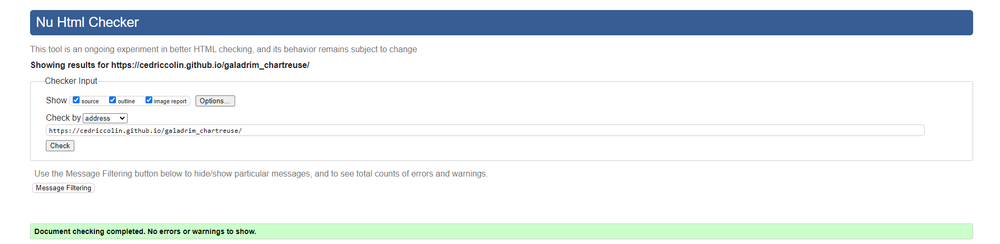
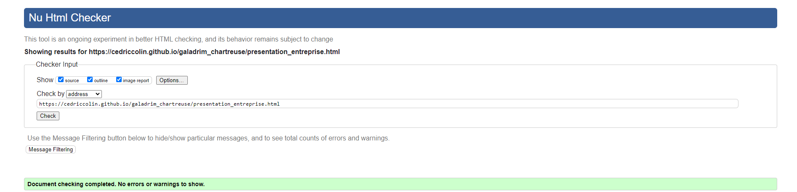
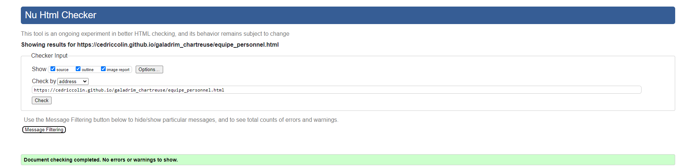
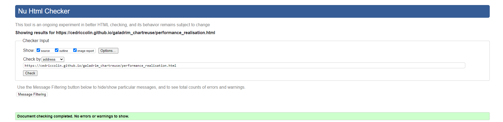
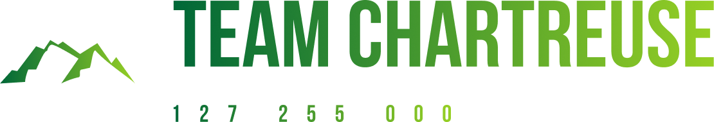

# Sujet de SAE 5 et 6

## Sujet

[Accueil | Team Chartreuse (github.io)](https://cedriccolin.github.io/galadrim_chartreuse/)

## Membres du groupe 

- [Baptiste DULIEUX **(référent du groupe)**](mailto:baptiste.dulieux@edu.univ-fcomte.fr?subject=sae_5_et_6)
- [Marvyn LEVIN](mailto:marvyn.levin@edu.univ-fcomte.fr?subject=sae_5_et_6)
- [Corentin CONTINO](mailto:corentin.contino@edu.univ-fcomte.fr?subject=sae_5_et_6)
- [Simon COMBE](mailto:simon.combe@edu.univ-fcomte.fr?subject=sae_5_et_6)
- [Cédric COLIN](mailto:cedric.colin@edu.univ-fcomte.fr?subject=sae_5_et_6)

# Presentation du projet

Notre projet est de créer un site informatif qui retranscrit tout d’abord Galadrim ; entreprise du
numérique dans le développement de produits digitaux adaptés aux marchés. Dans celui-ci,
nous aurons retranscrit l’histoire de Galadrim depuis sa création jusqu’à son évolution actuelle
par le biais de la présentation de l’entreprise. Mais aussi l’équipe et le personnel à l’aide de
statistiques et d’organigrammes. Et pour finir, nous aurons inscrit les rapports économiques et
d’engagement de l’entreprise Galadrim.
- La Team Chartreuse.

## Choix de conception

Lorem Ipsum

## Développement Site Web et Validation des pages

### Page d'accueil

**Auteur : Marvyn LEVIN**

Vérificateur W3C : [index.html](https://validator.w3.org/nu/?showsource=yes&showoutline=yes&showimagereport=yes&doc=https%3A%2F%2Fcedriccolin.github.io%2Fgaladrim_chartreuse%2F)

### Page "présentation de l'entreprise"

**Auteur : Corentin CONTINO**

Vérificateur W3C : [presentation_entreprise.html](https://validator.w3.org/nu/?showsource=yes&showoutline=yes&showimagereport=yes&doc=https%3A%2F%2Fcedriccolin.github.io%2Fgaladrim_chartreuse%2Fpresentation_entreprise.html)

### Page "équipe et personnel"

**Auteur : Cédric COLIN**

Vérificateur W3C : [equipe_personnel.html](https://validator.w3.org/nu/?showsource=yes&showoutline=yes&showimagereport=yes&doc=https%3A%2F%2Fcedriccolin.github.io%2Fgaladrim_chartreuse%2Fequipe_personnel.html)

### Page "performances et réalisations"

**Auteur : Simon COMBE**

Vérificateur W3C : [performance_realisation.html](https://validator.w3.org/nu/?showsource=yes&showoutline=yes&showimagereport=yes&doc=https%3A%2F%2Fcedriccolin.github.io%2Fgaladrim_chartreuse%2Fperformance_realisation.html)

### Page "Engagement social et responsabilité"

**Auteur : Baptiste DULIEUX**

Vérificateur W3C : [engagement_social_responsabilité.html](https://validator.w3.org/nu/?showsource=yes&showoutline=yes&showimagereport=yes&doc=https%3A%2F%2Fcedriccolin.github.io%2Fgaladrim_chartreuse%2Fengagement_social_responsabilit%25C3%25A9.html)

## Répartition du travail

### Planification - Diagramme de GANTT

- Marvyn LEVIN

### Recherches d'informations

- Simon COMBE
- Cédric COLIN

### Rapport économique

- Simon COMBE
- Marvyn LEVIN
- Baptiste DULIEUX

### Développement site

- Marvyn LEVIN
    - Page d'accueil
- Corentin CONTINO
    - Page présentation de l'entreprise
    - Intégration de la carte Google Map
- Baptiste DULIEUX
    - Page engagement social et responsabilité
- Simon COMBE
    - Page performances et réalisations
- Cédric COLIN
    - Page de l'équipe et du personnel
    - "Template" de page (Navbar/Footer/bouton de retour en haut de page)
    - Modèle 3D + implémentation sur le site

  

SAE de semestre 1 ; compétences 5 et 6. 
Département informatique.